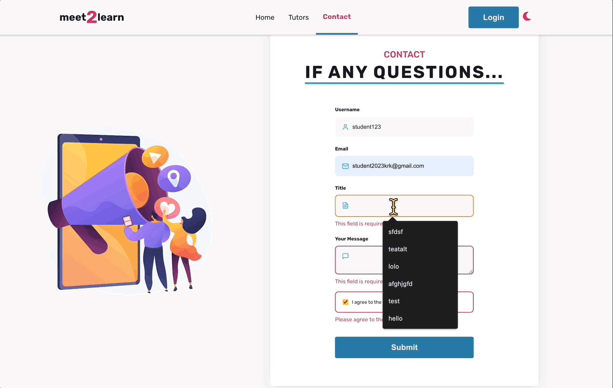
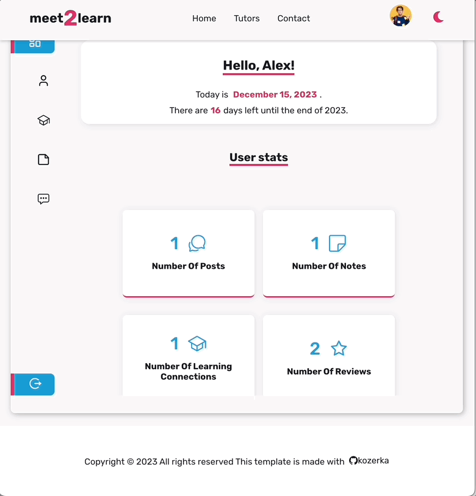
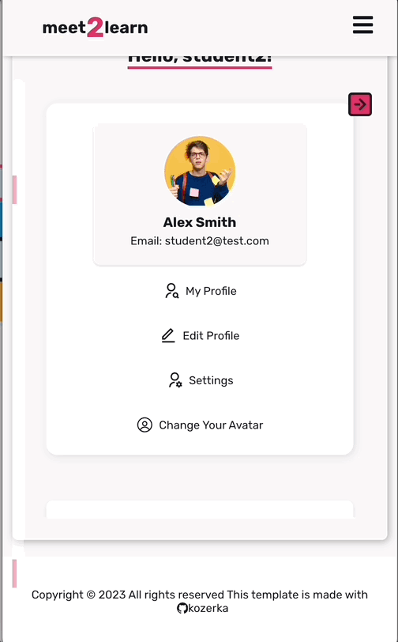
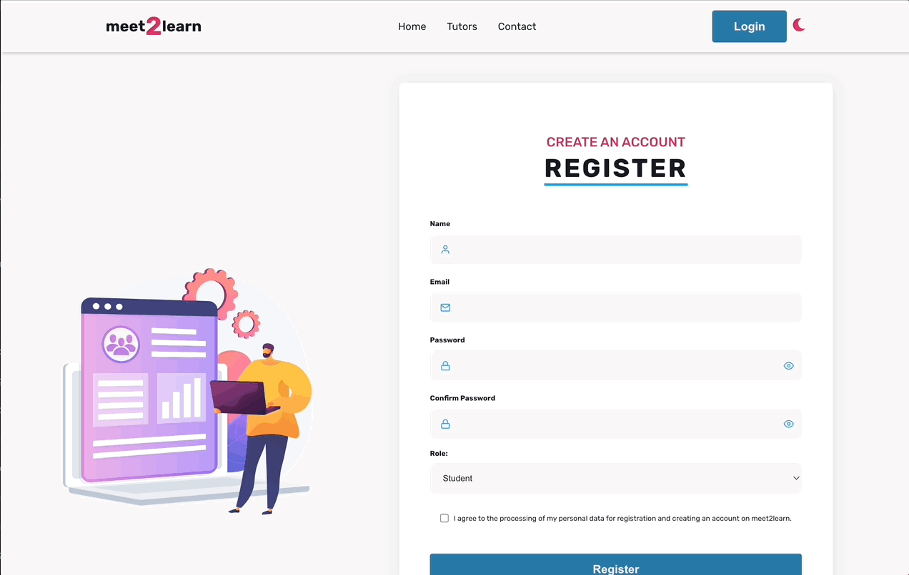
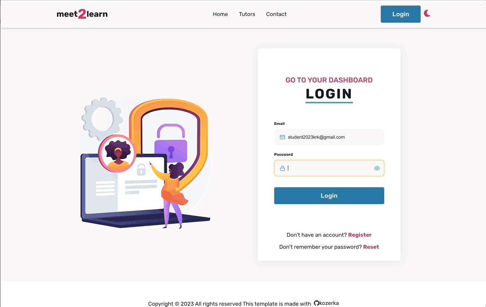
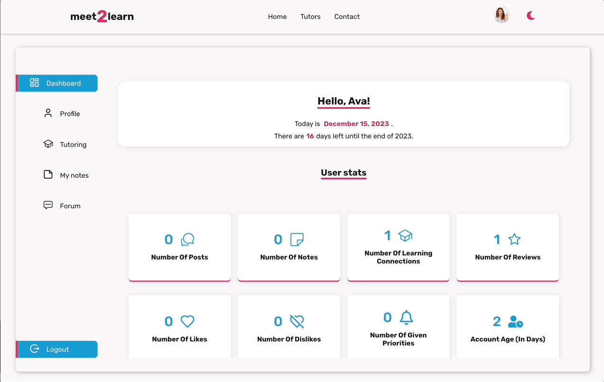
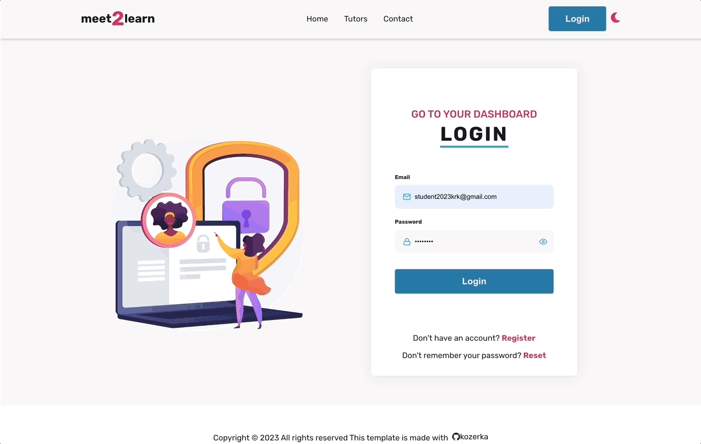
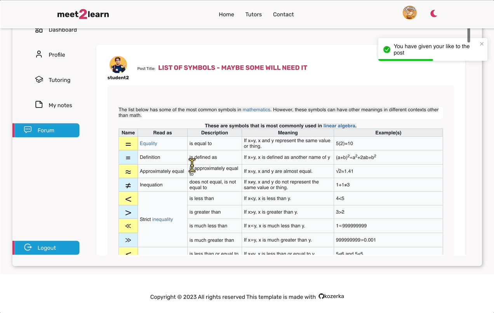

# meet2learn 

## 📖 Overview

Meet2Learn is a platform that makes it easy and friendly for students and tutors to work together and communicate. It's a great place for students to talk to each other, arrange meetings with tutors, and also make new friends. Plus, every user can actively manage their own profile, giving them control over their Meet2Learn experience.

<p align="center">
  
</p>

## 🌍 Live

To check all the features please register. If you want to be able to control your account please provide VALID email! All dummy email will be deleted from DataBase after 10 days ->
[meet2learn LIVE](https://meet2learn.netlify.app/)

## 💻 Technology Stack

      


## 📝 Features

### Responsive and Adaptive Landing Page
- **Responsive Design**: The landing page is fully responsive, ensuring a seamless user experience across various devices and screen sizes.
- **Dark Mode**: A user-friendly dark mode option for enhanced accessibility and viewing comfort, especially in low-light environments.

### Desktop
<p align="center">
  
  
</p>

### Tablet
<p align="center">
  
  
</p>

### Mobile
<p align="center">
  
  
</p>

### User Registration and Role System
- **User Roles**: Two primary user roles: Student and Tutor.
- **Registration**: Users can sign up as either a student or a tutor.

<p align="center">
  
  
</p>

### Tutor Profiles and Search Functionality

- **Advanced Search**: Students can search for tutors based on subjects and tutor names. Filtering and pagination,  managed server-side for performance efficiency.
- **Exclusive Reviews**: Students can leave reviews and star ratings on tutor profiles.
- **Tutor Feedback**: Helps students make informed choices based on peer reviews.

<p align="center">
  
  
</p>

### Student-Tutor Connections
- **Making Connections**: Students can connect with tutors for lessons or mentorship.
- **Personalized Dashboard**: Features a customizable dashboard for each user, displaying active connections and enabling direct communication with tutors.

<p align="center">
  
  
</p>

### Profile Management
- **Customization Options**: Users can edit their profiles, including adding a profile picture.
- **🔐 Security Features**: Options to change passwords, reset forgotten passwords, and delete accounts.
- **Tutor Profiles**: Tutors can create and manage their profiles, showcasing their expertise and subjects they teach. They need to fill the profile to be reachable, if not the profile will be pending.
<p align="center">
  
  
</p>

### Activity Dashboard
- **User Activity**: Each user has a personalized dashboard displaying their activity statistics.

### Interactive Forum
- **Community Engagement**: A forum for all registered users to exchange experiences on various topics including academics and social networking.
- **Post Prioritization**: Users can prioritize posts; prioritized posts appear higher in the feed.
- **Real-Time Updates**: Posts are updated in real-time; any modification brings a post to the top of the feed.
- **Category Filtering**: Posts are categorized and can be filtered, with filtering handled server-side.
- **Rich Content Editor**: The application includes a rich text editor, allowing posts to reflect the original format of the content including images, videos, and audio.

### Note Manager
- **Organized Notes**: A note manager with tag-based filtering and pagination, again managed server-side for performance efficiency.

<p align="center">
  
  
</p>

---

## Technological Enhancements

### Backend-Driven Performance
- **Efficiency and Speed**: Key functionalities are implemented on the backend to enhance application performance.

### React Creatable Select
- **Dynamic Tagging**: Implemented React Creatable Select for dynamic tagging capabilities. This feature allows users, especially tutors, to add custom tags dynamically, enhancing the searchability and categorization of their profiles and posts.

### Form Handling with Formik and Yup
- **Streamlined Form Management**: Utilized Formik for efficient form handling, significantly simplifying the process of managing form state and submissions.
- **Validation**: Integrated Yup with Formik to provide a seamless and robust validation mechanism. This combination allows for the creation of distinct validation schemas, ensuring data integrity and user-friendly feedback on form inputs.

```javascript
 export const useLoginForm = (dispatch, navigate) => {
	return useFormik({
		initialValues: { email: '', password: '' },
		validationSchema: loginFormSchema,
		onSubmit: async (values, { setSubmitting }) => {
			try {
				const actionResponse = await dispatch(loginUser(values));
				if (loginUser.fulfilled.match(actionResponse)) {
					dispatch(fetchUser());
					toast.success('Login successful!');
					navigate('/dashboard');
				} else {
					throw actionResponse;
				}
			} catch (error) {
				const errorMessage = error?.payload?.message || 'Error occurred during login';
				toast.error(errorMessage);
			} finally {
				setSubmitting(false);
			}
		},
	});
};
```

### Redux Toolkit with createAsyncThunk 
- **State Management**: Used Redux Toolkit for efficient state management, making the application's state predictable and easier to manage.
- **Asynchronous Actions**: Leveraged createAsyncThunk for handling asynchronous actions. This modern approach simplifies the handling of API calls and data fetching, ensuring a smooth and responsive user experience.
- **Enhanced Developer Experience**: The use of Redux Toolkit and createAsyncThunk not only improves application performance but also enhances the developer experience by reducing boilerplate code and providing powerful tools for debugging and state observation.


### Custom Hooks for Component Management
- **Custom Hooks**: In the case of large and complex components, implemented custom React hooks. This approach allows to encapsulate component logic and state management, making the components more organized and maintainable.
- **Logical Separation**: Moving the logic into separate custom hooks makes the codebase cleaner but also enhances readability and makes debugging easier.
- **Reusable Logic**: Custom hooks offer the advantage of reusability. The same logic can be employed across different components, reducing redundancy and keeping the code DRY (Don’t Repeat Yourself).
```javascript
export const useTutorData = tutorId => {
	const dispatch = useDispatch();
	const { tutor, isLoading: isTutorLoading } = useSelector(state => state.tutors);
	const { reviews, isLoading: isReviewsLoading } = useSelector(state => state.reviews);
	const [editingReview, setEditingReview] = useState(null);

	useEffect(() => {
		if (tutorId) {
			dispatch(getTutorById(tutorId));
			dispatch(getTutorReviews(tutorId));
			dispatch(fetchUser());
		}
	}, [dispatch, tutorId]);

	const isLoading = isTutorLoading || isReviewsLoading;

	return { tutor, reviews, isLoading, editingReview, setEditingReview };
};
```

## ⚙️ Configuration

To use this application locally, you need to download both this repository and the backend repository - > [go to BE repository](https://github.com/kozerka/meet2learn-BE). Follow the instructions in each repository for setup. The application has both 'develop' branches configured to use online, however, if you want to run the application with a local backend, you must follow the specific instructions provided in the documentation.

## 👉 Getting Started

1. Clone the repository:
   ```
   git clone [repository_url]
   ```
2. Navigate to the project directory:
   ```
   cd [Repo-Name]
   ```
3. Install the required dependencies:
   ```
   npm install
   ```
4. Start the application:
   ```
   npm start
   ```
   
The application will now be running on `http://localhost:3000`.

## ⭐️ Future Development Plans

The application is set for some exciting updates. Here's what's planned for the future:

- **Introduction of Admin Role**: The backend and routing have been designed to easily add an admin role. This role will bring new levels of management and oversight to the app.

- **Two-Step Verification for Tutor Accounts**: There are plans to add a two-step verification process for tutors. This will help in ensuring that the content they publish is secure and trustworthy.

- **Expanded Dashboard Notifications**: The dashboard will be upgraded to show more notifications. Users will be informed about new posts, comments, messages from tutors, and other important updates.

- **User Engagement Enhancements**: The app will include new features to make it more interactive and engaging. This might include elements like badges for achievements or personalized learning paths.

- **Mobile App Development**: Plans are in the works to develop a mobile version of the app, making it easy for users to access the platform from anywhere.

These updates are aimed at making the app more user-friendly, secure, and engaging. Keep an eye out for these exciting changes!

## 💪 Contributing

If you'd like to contribute, please fork the repository and make changes as you'd like. Pull requests are warmly welcome.

## 💬  Feedback

If you have any feedback or issues, please open an issue in this repository.

## ⚠️ License

[MIT](https://choosealicense.com/licenses/mit/)

---

Created with ❤️ by [kozerka].

---

&nbsp;

## 🙏 Special Thanks

A heartfelt thank you to my [Mentor - devmentor.pl](https://devmentor.pl/) for setting forth this challenge.

---
